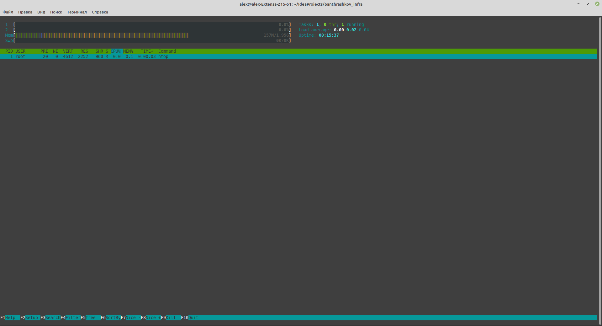
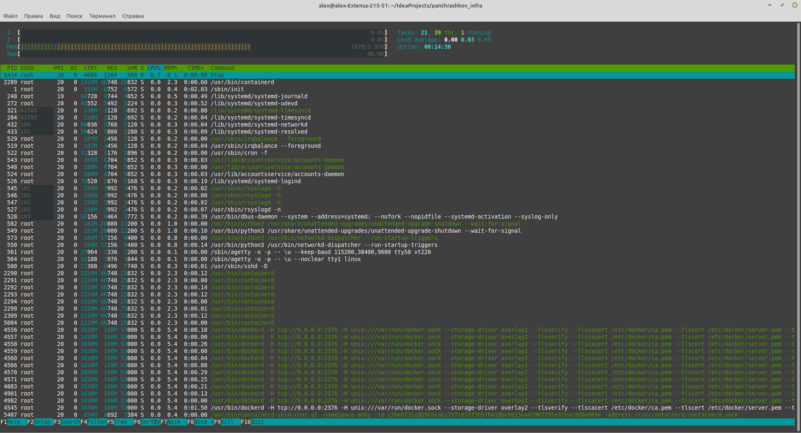

1. Install docker, docker-compose, docker-machine
2. Check
(sudo) docker version
(sudo) docker info
3. Run docker hello world container
docker run hello-world
output
Digest: sha256:df5f5184104426b65967e016ff2ac0bfcd44ad7899ca3bbcf8e44e4461491a9e
Status: Downloaded newer image for hello-world:latest

Hello from Docker!
4. List running containers
docker ps
- output CONTAINER ID   IMAGE     COMMAND   CREATED   STATUS    PORTS     NAMES
List all containers
docker ps -a
CONTAINER ID   IMAGE         COMMAND    CREATED         STATUS                     PORTS     NAMES
9ab9d7c0adea   hello-world   "/hello"   3 minutes ago   Exited (0) 3 minutes ago             laughing_hawking

5. List docker images
docker images
REPOSITORY    TAG       IMAGE ID       CREATED        SIZE
hello-world   latest    d1165f221234   4 months ago   13.3kB
6. Run container ubuntu and bash in it
docker run -it ubuntu:18.04 /bin/bash
create tmp file
run new container with same image
tmp file not exits
7. find container with tmp file
docker ps -a --format "table {{.ID}}\t{{.Image}}\t{{.CreatedAt}}\t{{.Names}}"
CONTAINER_ID = 1f9be8334f92
8. start same container
docker start 1f9be8334f92
9. Attach terminal to container
docker attach 1f9be8334f92
10. Check that file exist
11. List running containers
    docker ps
    CONTAINER ID   IMAGE          COMMAND       CREATED         STATUS              PORTS     NAMES
    1f9be8334f92   ubuntu:18.04   "/bin/bash"   6 minutes ago   Up About a minute             vigilant_proskuriakova
12. Use docker exec to run container
docker exec -it 1f9be8334f92 bash
13. Create image from container
 docker commit 1f9be8334f92 yourname/ubuntu-tmp-file
14. Check image
docker images
REPOSITORY                 TAG       IMAGE ID       CREATED          SIZE
yourname/ubuntu-tmp-file   latest    19351dddbac2   10 seconds ago   63.1MB
15. Docker kill and stop
- kill running docker containers
docker kill $(docker ps -q)
16. Check how mach space docker use
docker system df
17. Remove containers and images
rm - docker rm $(docker ps -a -q)
rmi - docker rmi $(docker images -q)

18. work with docker with yacloud
create vm
yc compute instance create \
  --name docker-host \
  --zone ru-central1-a \
  --network-interface subnet-name=ru-central1-a-reddit-app-ru-central1-a,nat-ip-version=ipv4 \
  --create-boot-disk image-folder-id=standard-images,image-family=ubuntu-1804-lts,size=15 \
  --ssh-key ~/.ssh/appuser.pub
create docker-machine
docker-machine create \
  --driver generic \
  --generic-ip-address=178.154.222.76 \
  --generic-ssh-user yc-user \
  --generic-ssh-key ~/.ssh/appuser \
  docker-host
19. run bash on docker machine
eval $(docker-machine env docker-host)
20. docker-machine ls
NAME          ACTIVE   DRIVER    STATE     URL                         SWARM   DOCKER     ERRORS
docker-host   *        generic   Running   tcp://178.154.222.76:2376           v20.10.7
21.  Compare
docker run --rm -ti tehbilly/htop

docker run --rm --pid host -ti tehbilly/htop

22. Create dockerfile and file with settings
23. fill dockerfile and build image
docker build -t reddit:latest .
24. LIst images (include intermediate)
docker images -a
25. Run created container
docker run --name reddit -d --network=host reddit:latest
26. check result
docker-machine ls
(app started but exit with 1)
27. Login to docker hub
login - panthrashkov
28. Push image to docker hub
docker tag reddit:latest panthrashkov/otus-reddit:1.0
docker push panthrashkov/otus-reddit:1.0

21639b09744f: Mounted from library/ubuntu
1.0: digest: sha256:421be6f881cd08f9524dd1d89714dd3a7647b1bd470d9715ecf814421416345d size: 2414

29. Run container from this image localy
docker run --name reddit -d -p 9292:9292 panthrashkov/otus-reddit:1.0

