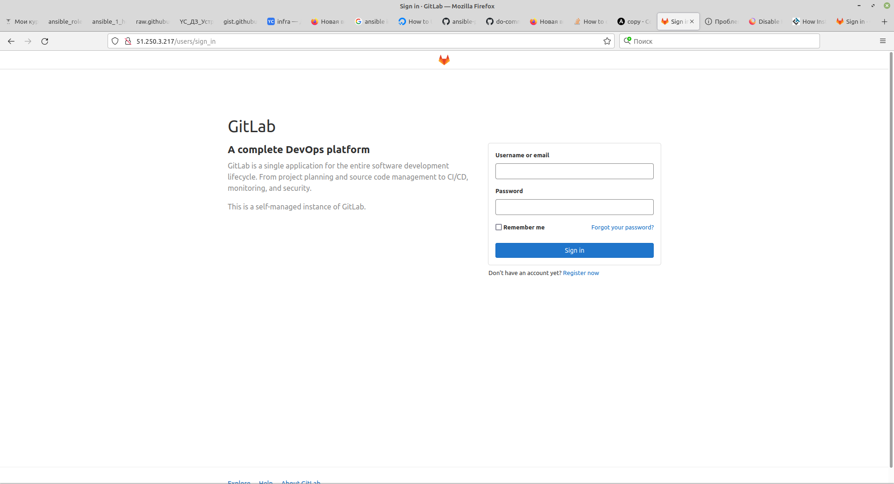
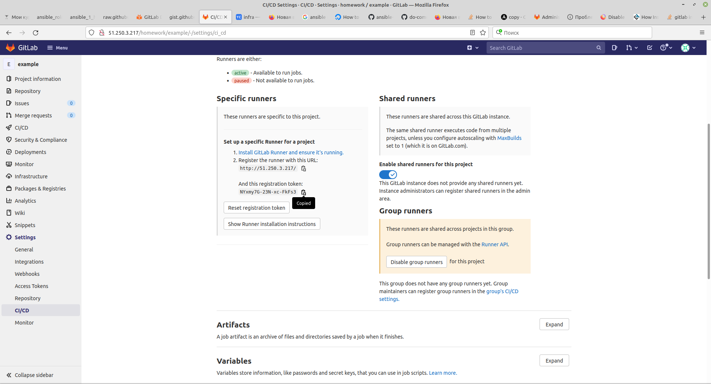
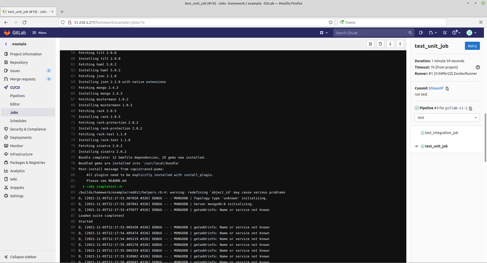
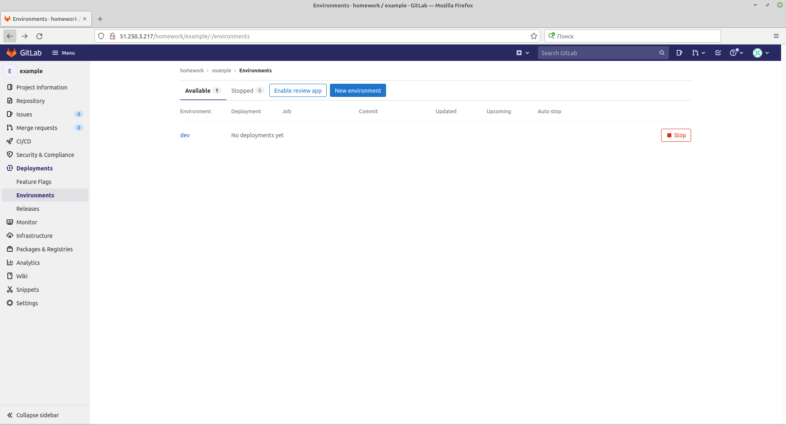
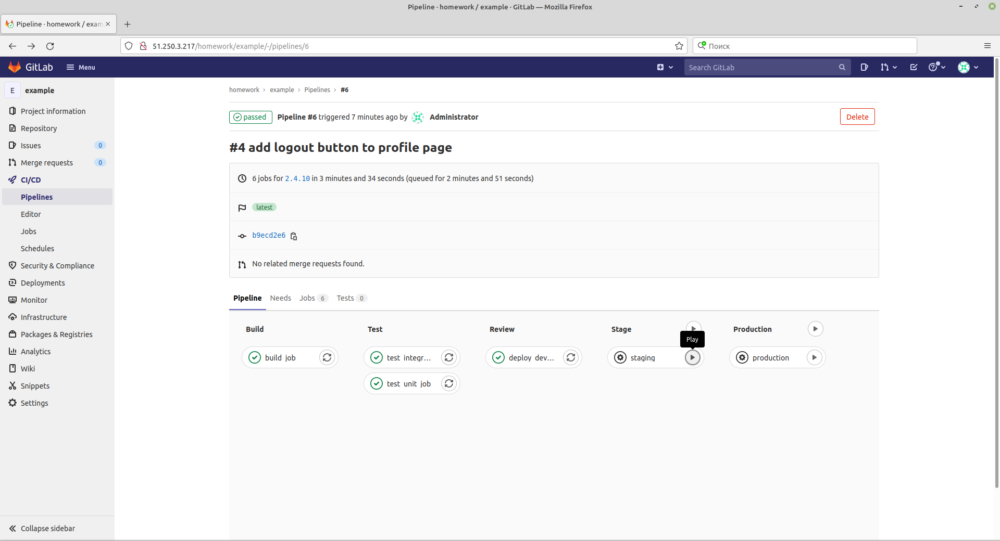

1. Create virtual machine
```bash
cd terraform/stage
   terraform init
   terraform plan 
   terraform apply --auto-approve
```  
2 copy ip from output and paste to ansible inventory and docker-compose.yml

3. install docker, docker-compose and  gitlab using docker-compose
```bash
cd ../../ansible
ansible-playbook playbook.yml -l gitlab-ci -u ubuntu
```   

7. get gitlab root password
sudo docker exec -it 042c541924a9 grep 'Password:' /etc/gitlab/initial_root_password
 
8. create proejct in gitlab ui

   
9. Add remote and push project
   git remote add gitlab http://51.250.3.217/homework/example.git
   git push gitlab gitlab-ci-1
   
10. Add .gitlab-ci.yml file for pipeline configuration
```bash
git add .gitlab-ci.yml
git commit -m 'add pipeline definition'
git push gitlab gitlab-ci-1
```

11. Get token for runner
    
12. Start runner
```bash
sudo docker run -d --name gitlab-runner --restart always -v /srv/gitlab-runner/config:/etc/gitlab-runner -v \
    /var/run/docker.sock:/var/run/docker.sock  gitlab/gitlab-runner:latest
```
13. Register runner
```bash
sudo docker exec -it gitlab-runner gitlab-runner register \
    --url http://51.250.3.217/ \
    --non-interactive \
    --locked=false \
    --name DockerRunner \
    --executor docker \
    --docker-image alpine:latest \
    --registration-token NYxmy7G-23N-xc-FkFs3 \
    --tag-list "linux,xenial,ubuntu,docker" \
    --run-untagged
```

14. add reddit to repository
    ```bash
    git clone https://github.com/express42/reddit.git && rm -rf ./reddit/.git
    git add reddit/
    git commit -m "Add reddit app"
    git push gitlab gitlab-ci-1
    ```
    
15. Some modification to gitlab-ci.yml, simpletest.rb, Gemfile - to run  test. push
    
16. Work with environments
    
17. Add manual run
    
18. Add dynamic environments