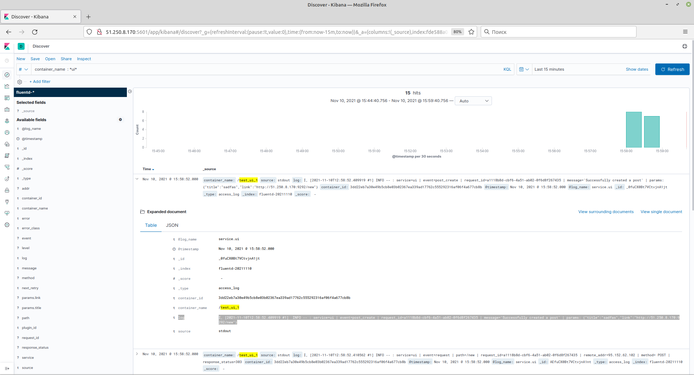
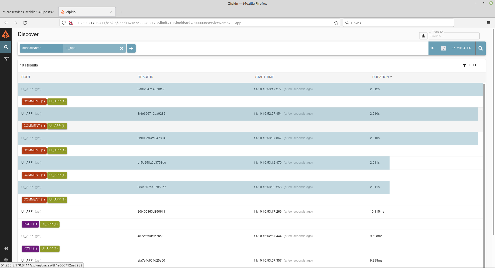

1. Create virtual machine
```bash
cd terraform
   terraform init
   terraform plan 
   terraform apply --auto-approve
```  
external_ip_address = 51.250.8.170

2. create docker machine
```bash
docker-machine create loggingHost --driver generic --generic-ip-address 51.250.8.170 --generic-ssh-user ubuntu  --generic-ssh-key ~/.ssh/appuser
```
3. connect to docker-machine
```bash
eval $(docker-machine env loggingHost)
```
4. Create images with logging
```bash
export USER_NAME='panthrashkov'
for i in ui post-py comment; do cd src/$i; bash docker_build.sh; cd -; done
```
5. Create fluentd Dockerfile and fluentd config file
6. Create fluentd docker image
```bash
   cd logging/fluentd
   docker build -t $USER_NAME/fluentd .
```
7. Edit docker compose file to use logging images
8. Run docker compose file
```bash
   cd docker 
   docker-compose up -d
```   
9. Get post logs    
```bash
   docker-compose logs -f post
```
10. Connect to services
prometheus - http://51.250.8.170:9090
reddit  - http://51.250.8.170:9292

11. Add fluentd to docker-compose to post service
12. Run fluentd and rerun microservices
```bash
docker-compose -f docker-compose-logging.yml up -d 
docker-compose down 
docker-compose up -d
```
13. Connect to kibana
    http://51.250.8.170:5601/app/kibana
14. Add index

15. Add filter to fluentd configuration and rebuild docker image
```bash
docker build -t $USER_NAME/fluentd 
```
16. Rerun fluentd
```bash
docker-compose -f docker-compose-logging.yml up -d fluentd
```
17. Add logging to ui service. And recreate services
    docker-compose stop ui
    docker-compose rm ui
    docker-compose up -d
18. See unstructured logs

19. Add filter ui 
20. to fluentd configuration and rebuild docker image
```bash
docker build -t $USER_NAME/fluentd 
```
20. Rerun fluentd
```bash
docker-compose -f docker-compose-logging.yml up -d fluentd
```
21. Use grok templates for parse logs
22. add zipkin to docker compose (for microservices and for logging )
rerun all containers
    docker-compose -f docker-compose-logging.yml -f docker-compose.yml down
    docker-compose -f docker-compose-logging.yml -f docker-compose.yml up
23. Open zipkin
     
