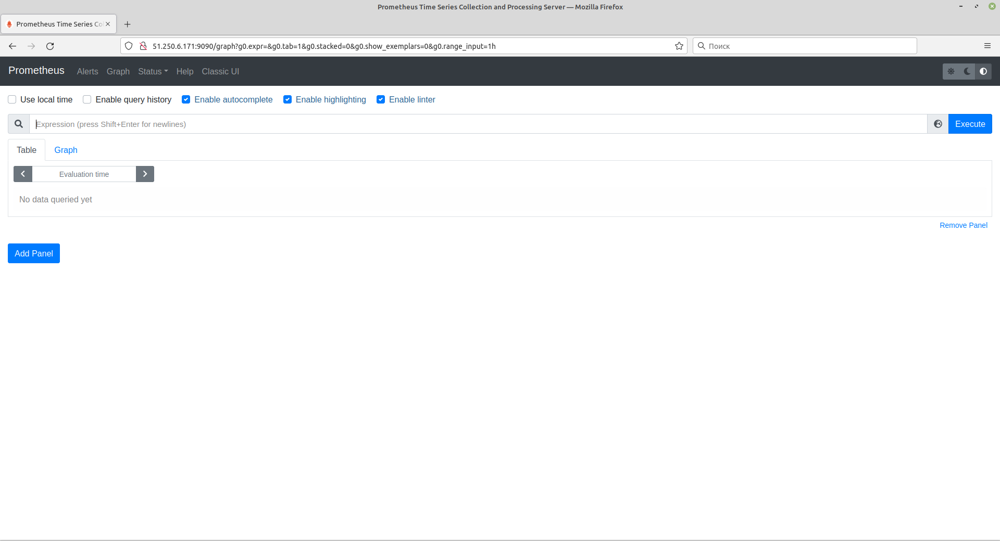
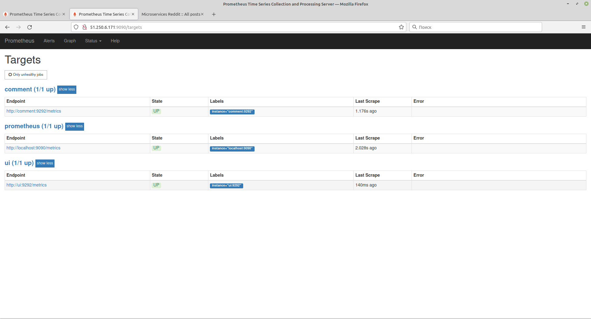
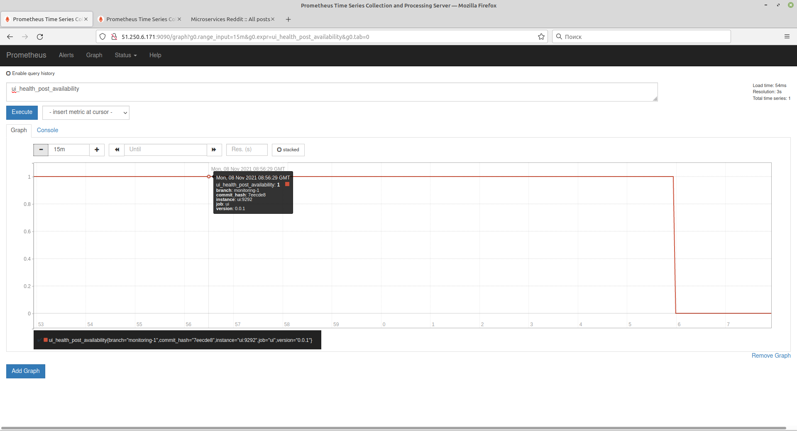
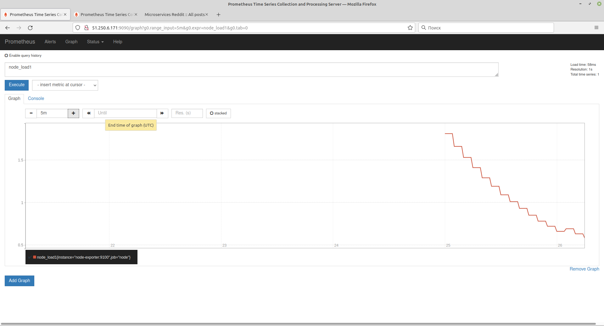

1. Create virtual machine
```bash
cd terraform
   terraform init
   terraform plan 
   terraform apply --auto-approve
```  
external_ip_address=51.250.6.171

2. create docker machine
```bash
docker-machine create monitoringHost --driver generic --generic-ip-address 51.250.6.171 --generic-ssh-user ubuntu  --generic-ssh-key ~/.ssh/appuser
```
3. connect to docker-machine
```bash
eval $(docker-machine env monitoringHost)
```
4. run prometeus in docker container
docker run --rm -p 9090:9090 -d --name prometheus  prom/prometheus 
5. connect to prometeus
http://51.250.6.171:9090/graph

6. Expose metrics prometheus_build_info
get - prometheus_build_info{branch="HEAD", goversion="go1.17.3", instance="localhost:9090", job="prometheus", revision="411021ada9ab41095923b8d2df9365b632fd40c3", version="2.31.1"}
7. see prometheus metrics
http://51.250.6.171:9090/metrics
```text
# HELP go_gc_duration_seconds A summary of the pause duration of garbage collection cycles.
# TYPE go_gc_duration_seconds summary
go_gc_duration_seconds{quantile="0"} 6.4253e-05
go_gc_duration_seconds{quantile="0.25"} 8.1281e-05
....
```
8.stop container
```bash
docker stop prometheus
```
9. Create own docker image from prometheus base image with settings
```bash
export USER_NAME=panthrashkov@rambler.ru
docker build -t $USER_NAME/prometheus .
```
10. Build new images for microservices
```bash 
for i in ui post-py comment; do cd src/$i; bash docker_build.sh; cd -; done
```
11. Modify docker-compose file to run services with prometeus (add prometeus, remove build phase)
12. Run docker compose 
```bash
    docker-compose up -d
```
14. All endpoints up

15. Check ui_health
    ui_health{branch="monitoring-1",commit_hash="7eecde8",instance="ui:9292",job="ui",version="0.0.1"}
16. Stop post
    docker-compose stop post 
 Stopping test_post_1 ... done

17. Run post
    docker-compose start post

18. Add node exporter to docker compose and prometheus config, rebuild prometheus
    docker build -t $USER_NAME/prometheus .
19. Rerun docker compose file
    docker-compose down
    docker-compose up -d
20. Get cpu load use node_load1
    

21. Push to docker hub
    https://hub.docker.com/repository/docker/panthrashkov/prometheus
    https://hub.docker.com/repository/docker/panthrashkov/post
    https://hub.docker.com/repository/docker/panthrashkov/comment
    https://hub.docker.com/repository/docker/panthrashkov/ui


