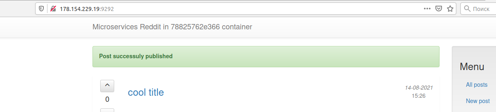

# Micorservices
Steps to make homework
1. Install Intellij Idea plugin for docker lint https://plugins.jetbrains.com/plugin/16284-whalelint
2.
create vm
yc compute instance create \
  --name docker-host \
  --zone ru-central1-a \
  --network-interface subnet-name=ru-central1-a-reddit-app-ru-central1-a,nat-ip-version=ipv4 \
  --create-boot-disk image-folder-id=standard-images,image-family=ubuntu-1804-lts,size=15 \
  --ssh-key ~/.ssh/appuser.pub
create docker-machine
docker-machine create \
  --driver generic \
  --generic-ip-address=178.154.229.19 \
  --generic-ssh-user yc-user \
  --generic-ssh-key ~/.ssh/appuser \
  docker-host
check machine list
docker-machine ls
connect to docker-machine
eval $(docker-machine env docker-host)
2. download reddit-microservices and rename to src
3. Create 3 dockerfiles for 3 microservices
comment
post
ui
4.pull mongo image
docker pull mongo:latest
build service images
docker build -t panthrashkov/post:1.0 ./post-py
docker build -t panthrashkov/comment:1.0 ./comment
docker build -t panthrashkov/ui:1.0 ./ui

5. create network
docker network create reddit
6. run docker containers
docker run -d --network=reddit --network-alias=post_db --network-alias=comment_db mongo:latest
docker run -d --network=reddit --network-alias=post panthrashkov/post:1.0
docker run -d --network=reddit --network-alias=comment panthrashkov/comment:1.0
docker run -d --network=reddit -p 9292:9292 panthrashkov/ui:1.0

6. service works

7. Use new network-alias for post service (posts)
 docker run -d --network=reddit --network-alias=posts panthrashkov/post:1.0
set env variable on run ui service
docker run -d --network=reddit -e POST_SERVICE_HOST=posts -p 9292:9292 panthrashkov/ui:1.0

8. Check image size
9. Change ui docker file (change base image)
build start on first step
10. recreate image docker build -t panthrashkov/ui:2.0 ./ui
11. check images size
REPOSITORY             TAG             IMAGE ID       CREATED          SIZE
panthrashkov/ui        2.0             1bc813fc67d0   25 seconds ago   462MB
panthrashkov/ui        1.0             4acf35f09399   45 minutes ago   771MB
12. create docker volume
docker volume create reddit_db
13 rerun containers
docker kill $(docker ps -q)
docker run -d --network=reddit --network-alias=post_db --network-alias=comment_db -v reddit_db:/data/db mongo:latest
docker run -d --network=reddit --network-alias=post panthrashkov/post:1.0
docker run -d --network=reddit --network-alias=comment panthrashkov/comment:1.0
docker run -d --network=reddit -p 9292:9292 panthrashkov/ui:2.0
14. create post and rerun again
post exist
15.
